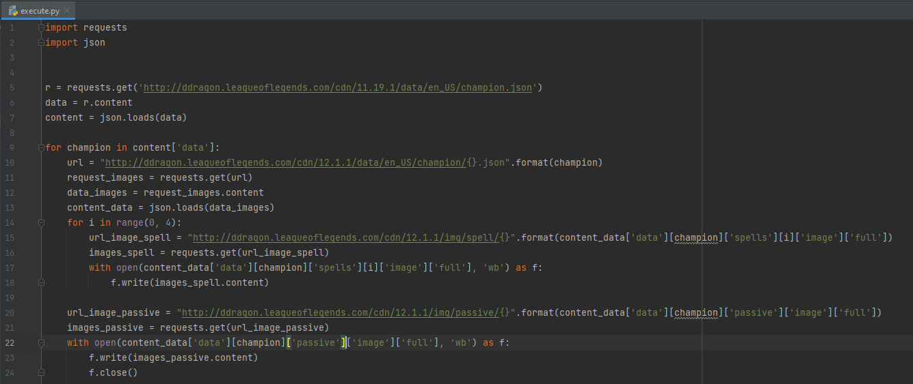
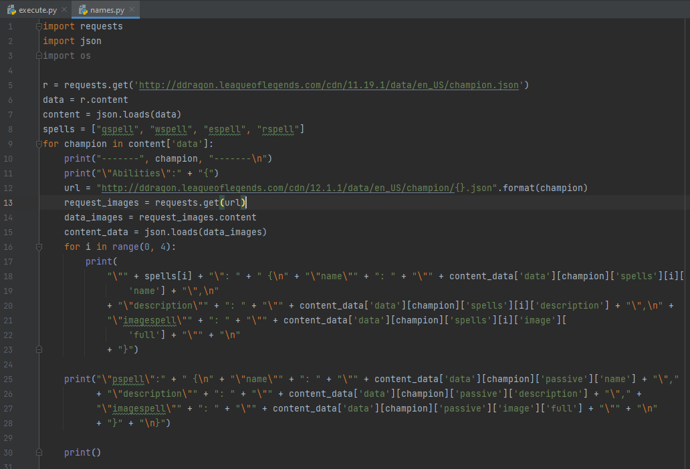
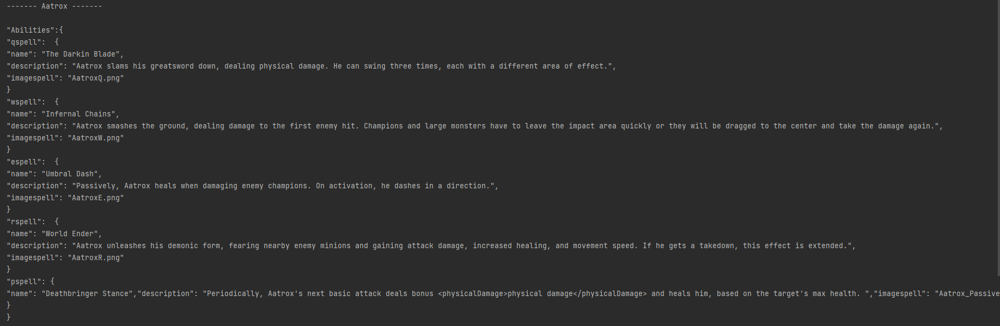
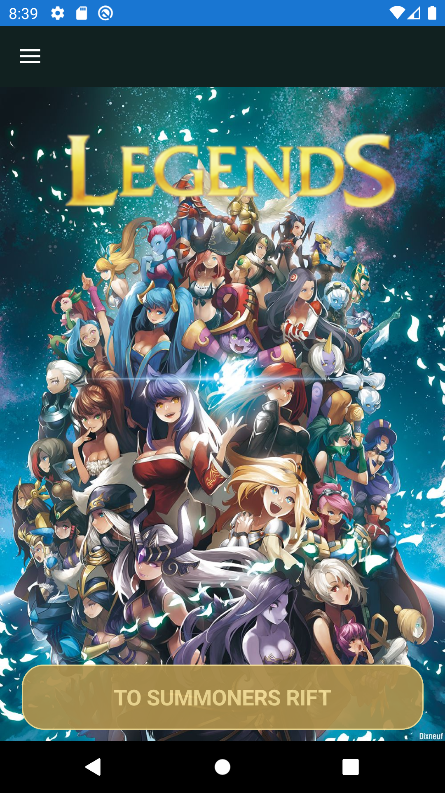

# Project C# Mobile 2021-2022
* Naam: Ilias Agnaou
* Onderwerp: Alle champions, stats en extra's van het spel League Of Legends
## Korte uitleg doel applicatie (uiteindelijk aangevuld met screenshots)
Voor het vak C# Mobile ga ik een app maken rond het computerspel League Of Legends. League Of Legends is een spel dat uitgebracht is door Riot Games in 2009. Het is een tactische spel waar 2 teams van 5 spelers het tegen elkaar opnemen om hun basis te vernietigen. Met meer dan 140 champions of legens krijgen de spelers de mogelijkheid om het tegen elkaar op te nemen in een normal game of een ranked game.

De app zal een overzicht geven van alle League Of Legends Champions. Bij een gekozen champion worden alles details, verhalen en abilities weergegeven. De gebruiker krijgt de mogelijkheid om elke champion in detail te bestuderen voor een van hun games starten. Zo krijgt de speler de kans om in te schatten hoe sterk de champion is waar tegen ze het opnemen.

De gebruiker krijgt ook de mogelijkheid om in te loggen en te registreren en de meest recente updates van league of legends te consulteren.

## Logboek
<b>10/10/2021:<b> 
Vandaag ben ik op zoek gegaan naar welke league of legends API's ik kan gebruiken om de app te maken. Alle champion image tiles opgehaald en geïnitialiseerd met hun bijhorende naam. Champion.json van de league of legends API uitgelezen en in een dictionary gestoken. Extra klassen gemaakt voor het uitlezen van data te vergemakkelijken. Hiervoor heb ik het principe van model binding toegepast.
  
<b>27/10/2021:<b> 
Statische klassen gemaakt voor het ophalen van json data van de league of legends API zodat ik dit niet meer in de view zelf moet doen. Vervolgens succesvol de naam kunnen doorgeven naar de tabbed pages van de volgende pagina.
  
<b>23/11/2021:<b> 
Ik las eerst de naam en de image van de champion uit met een list van legend objecten waar ik door ittireerde om elke champion met bijhorende naam te laten zien. image url heb ik ook mee opgenomen in het json-bestand. De list van legend objecten heb ik verwijderd en heb ik de statische methode van legend data ingelezen.

<b>19/01/2022:<b> 
MVVM Patroon geïmplementeerd. Kleurenpallet toegevoegd en algemene stijl gemaakt. Positie Icons toegevoegd om aan te tonen op welke positie de gekozen champion speelt. Het json-bestand ook aangepast met een lane veld met als waarde de image link naar het icoon van de positie van de champion.
  
<b>20/01/2022:<b> 
Vandaag beseft dat bron 3 meer informatie bevat over de champion dan alles in bron 2. Vandaar heb ik beslist om elke keer als ik iets nodig heb de champion.json aan te passen. Dus ik ga een soort van eigen API maken. De lore dat al in brone 2 beschikbaar was is onvolledig dus ik heb afzonderlijk voor elke champion de lore van bron 3 gekopieert en geplakt in bron 2. Tijdelijk Lore toegevoegd aan details pagina om te zien hoe het zou uitkomen.
  
<b>22/01/2022:<b> 
Ik heb twee dagen vastgezeten aan hoe ik zelfgemaakte progressbars zou toevoegen aan het project. De waarde van de basis info van elke champion wou niet getoond worden in de progressbars. Ik heb dit uiteindelijk opgelost door een zelfgemaakte frame te maken dat leek op een progressbars. Daar in heb ik de built-in progressbars van xamarin toegevoegd en het werkte zoals ik het wou.
  
In League of legends zijn er 6 verschillende champion genres. Zo is er Fighter, Mage, Support, Tank, Marksman en Assassin. Dit bestond niet in de API dus ik ben op internet gaan zoeken naar deze Icons en heb die op dezelfde manier als Lane opgenomen in het json-bestand.
  
<b>24/01/2022:<b> 
Klassen toegevoegd voor ally tips en enemy tips en deze ook mee opgenomen in het json-bestand. Ally tips zijn voor de gebruiker aan te tonen hoe in team samen moet spelen met de gekozen champion. Enemy tips is volledig het tegenovergestelde daarvan.
  
Splash art toegevoegd en image url opgenomen in het json-bestand. Deze heb ik gevonden op de lol API in een zip bestand (bron 5). Hiervoor heb ik een property in mijn Legend class toegevoegd.
  
Het json-bestand een beetje opgekuist.
  
Ik heb klassen gemaakt voor abilities te initialiseren om er morgen aan te beginnen.
  
<b>25/01/2022:<b>
De afbeeldingen van alle abilities van elke champions had ik gevonden in bron 4 en hadden een verwijzing naar de images in bron 3. Ik heb 157 champions en elke champion heeft 5 abilities: Passive, Q-Spell, W-Spell, E-Spell en R-Spell. Mijn eerste probleem was hoe ik meer dan 700 images van de api kon afhalen. Ik heb hiervoor python gebruikt: 
 
In nog geen 5 minuten had ik al mijn images. Het enige wat mijn nog te doen stond was alle gegevens opnemen in mijn eigen json-bestand dit was ook een hele uitdaging omdat dit veel was want elke ability had zijn eigen naam, beschrijving en imageurl. Hier ben ik ook ingeslaagd door python te gebruiken. 
 
De output heb ik gekopieert en geplakt in mijn json-bestand. 
 
Voor de output van json-data heb ik een beetje valsgespeeld door trial en error met mijn prints.
  
Voor zowel het ophalen van de foto's als het genereren van de data, heb ik volledig zelf gedaan met de kennis van python dat ik al had.

Splash screen gemaakt met de hulp van bron 6.
  
<b>26/01/2022:<b> 
Een logo toegevoegd aan de splashscreen. Extra Flyout aan mijn home pagina toegevoegd. Lore pagina gemaakt en extra patchnotes toegevoegd in webview.
  
<b>28/01/2022:<b> 
Basis functionaliteit van een login en registratie met de hulp van bron 7 en 8. Het was me helaas niet meer gelukt om een logout en profiel pagina te maken.µ

## Screenshots App

  
## Link video

  
## Bronnen
1: https://developer.riotgames.com/docs/lol 
2: http://ddragon.leagueoflegends.com/cdn/11.19.1/data/en_US/champion.json 
3: http://ddragon.leagueoflegends.com/cdn/12.1.1/data/en_US/champion/Aatrox.json 
4: http://ddragon.leagueoflegends.com/cdn/12.1.1/img/passive/Aatrox_Passive.png 
5: https://ddragon.leagueoflegends.com/cdn/dragontail-10.10.5.zip 
6: https://www.youtube.com/watch?v=7KOAXV0vP3g 
7: https://www.youtube.com/watch?v=8JQSd9sF3XI 
8: https://www.youtube.com/watch?v=TuN8Y9sUCmw 

Login: https://www.youtube.com/watch?v=8JQSd9sF3XI
